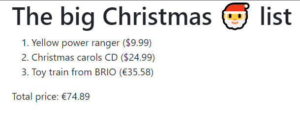

# Lab 6: Pipes

_🎄 Christmas edition_

In this lab, we'll be migrating our TypeScript application to Angular. After that, we will be creating our very own `displayProduct` pipe.



## Exercise 1: convert to Angular

Since installing Angular into an already existing (non-Angular) project is not supported with the `@angular/cli`, we will create a new Angular project and copy the contents over to our project instead.

1. Be sure you have the latest version of `@angular/cli` installed globally.
   ```sh
   npm uninstall -g @angular/cli
   npm i -g @angular/cli
   ```
1. From inside the root of your project, run this command:
   ```
   ng new christmas-wish-list --prefix cwl --directory angular-app --skip-install --skip-tests
   ```
   Choose `Angular routing: No` and `stylesheet format: "SCSS"`.
   Explanation:
   - We use `ng new christmas-wish-list` to create a new Angular project with the name "christmas-wish-list"
   - We use `--prefix cwl` to make sure this application uses `cwl` (Christmas Wish List) as it's prefix for components and directives.
   - We use `--directory angular-app` to make sure the new application is created inside the "angular-app" directory
   - We use `--skip-install` to make sure it doesn't run `npm install` in the new directory.
   - We use `--skip-tests` so a test file isn't created for the `AppComponent`, we will be creating that ourselves later.
1. Next, move the content of `angular-app` to the root of the project. Choose to override any existing files. This can best be done with Windows explorer, or equivalent tool.
1. Now install the dependencies with `npm install`.
1. Move your existing files inside the `src/app` directory. The result should look something like this:
   ```
   src
    ├── app
    │   ├── app.component.html
    │   ├── app.component.scss
    │   ├── app.component.ts
    │   ├── app.module.ts
    │   ├── models
    │   │   ├── currency.ts
    │   │   ├── index.ts
    │   │   ├── price.ts
    │   │   ├── product.ts
    │   │   └── supplier.ts
    │   └── wish-list.ts
    ├── assets
    ├── environments
    │   ├── environment.prod.ts
    │   └── environment.ts
    ├── favicon.ico
    ├── index.html
    ├── main.ts
    ├── polyfills.ts
    ├── styles.scss
    └── test.ts
   ```
1. Test your app. Use `npm start` or `ng serve`.
1. _Optional_, want to pimp your application? Install bootstrap with `npm i bootstrap@5` and add bootstrap styling to `styles.scss` file:

   ```scss
   @import '~bootstrap'
   ```

## Exercise 2: The price pipe

1. Replace the contents of the `app.component.html` file with:

   ```html
   <div class="container">
     <h1 class="display1">{{ christmasList.title }}</h1>

     <ol>
       <li *ngFor="let wish of christmasList.wishes">{{ wish | json }}</li>
     </ol>

     Total price: {{ christmasList.totalPrice | price }}
   </div>
   ```

1. Update the app.component.ts file to make the `christmasList` available. Fill it with a 3~ish items.
1. As you can see, the `price` pipe doesn't exist yet. Generate this pipe:

   ```shell
   ng generate pipe --skip-tests pipes/price
   ```

   _Note: use `--skip-tests` here, as we will be creating tests next lab_

1. Use the `CurrencyPipe` here to your advantage. Let it be injected in your pipe and use that to format the price. The `transform` method of the `CurrencyPipe` expects the currency code as a second argument `'USD'` for dollars and `'EUR'` for euros.

## Exercise 3: The `displayProduct` pipe.

1. Generate the `displayProduct` pipe:

   ```shell
   ng generate pipe --skip-tests pipes/displayProduct
   ```

1. Implement `transform` method. You can reuse the `Product.display` method here.
1. Switch out the `{{ wish | json }}` in the template with `{{ wish | displayProduct }}`.
