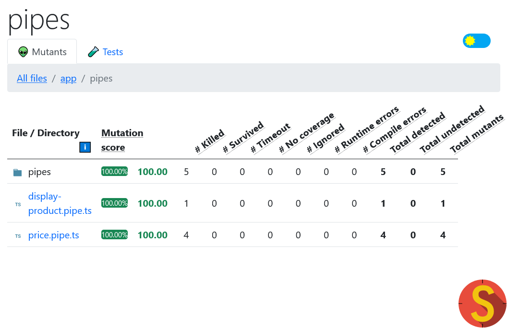

# Lab 7: Unit testing

_🎄 Christmas edition_

In this lab, we'll be testing our `displayProduct` and `price` pipes.

_Note: be the karma server is started and watching the tests. Use `npm test` or `ng test` to start this._



## Exercise 1: Unit test the `displayProduct` pipe

1. Create a file `display-product.pipe.spec.ts` next to `display-product.pipe.ts` and start with this code:

   ```ts
   import { DisplayProductPipe } from './display-product.pipe';

   describe('DisplayProductPipe', () => {
     it('should display a product without supplier', () => {
       // TODO
     });
   });
   ```

   Implement the first test. Make sure it passes.

1. Implement more tests as you see fit.

## Exercise 2: More testing: the `price` pipe

Now also test the `price` pipe. It depends on the `CurrencyPipe`. To improve test maintenance, inject a mock for the `CurrencyPipe`, so you can test the `price` pipe in isolation.

## If time permits...

Test your tests with mutation testing.

1. Install and init StrykerJS.
   ```bash
   npm install -D @stryker-mutator/core
   npx stryker init
   # Choose "angular-cli"
   ```
1. Run Stryker: `npx stryker run --concurrency 1`.
1. Inspect the HTML report it generates. Are there surviving mutants? Were you expecting them to survive? Try and improve your mutation score.
