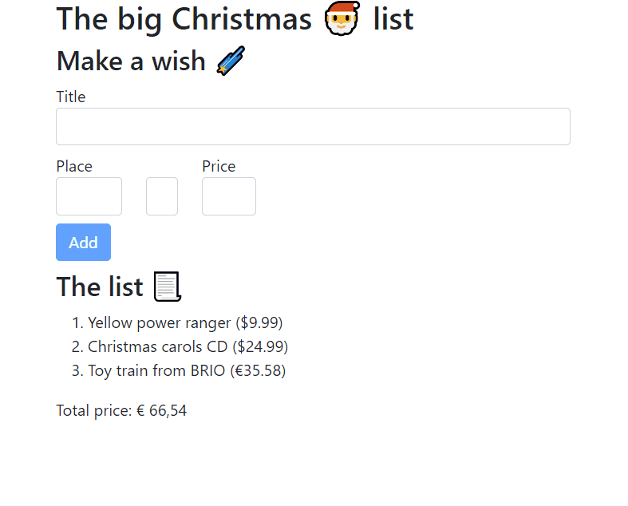

# Lab 8: Forms

_🎄 Christmas edition_

In this lab, we will add a form to create products and add them to our wish list.



## Exercise 1: Create a Product form

In this exercise we create a form for adding products. If you are familiar with the way Angular components work, you may create this form in a new component and add an `EventEmitter` to emit the event that a product is added.

1. Add a form the top of the wish list. It should contain 4 form control elements. Use this as template to help you get started:

   ```html
   <h2>Make a wish 🌠</h2>
   <form (ngSubmit)="addWish()">
     <div class="mb-2">
       <label for="titleInput">Title</label>
       <input id="titleInput" name="title" type="text" class="form-control" />
     </div>
     <div class="row mb-2">
       <div class="col-2">
         <label for="placeInput">Place</label>
         <input
           name="place"
           id="placeInput"
           class="col form-control"
           type="number"
           step="1"
         />
       </div>

       <div class="col-3">
         <div class="row">
           <div class="col-5">
             <label for="currencyInput"></label>
             <select id="currencyInput" class="form-control">
               <option value="Euro">€</option>
               <option value="Dollar">$</option>
             </select>
           </div>
           <div class="col">
             <label for="priceInput">Price</label>
             <input
               id="priceInput"
               name="title"
               type="number"
               class="form-control"
             />
           </div>
         </div>
       </div>
     </div>
     <div class="mb-2">
       <button class="btn btn-primary" type="submit">Add</button>
     </div>
   </form>
   ```

1. Make it so that clicking `Add` will add the product to the wish list. You have 3 choices here:
   1. Template driven with the `FormsModule`
   1. Model driven with the `ReactiveFormsModule`
   1. (a bit advanced) Model driven with type safety using [Type safe forms for angular](https://github.com/dirkluijk/ngx-typesafe-forms#type-safe-forms-for-angular-). \
      _Note: Install it with `npm i ngx-typesafe-forms --legacy-peer-deps`, as the angular peerDependency is still pinned to 12, see https://github.com/dirkluijk/ngx-typesafe-forms/issues/40_
1. Test it out! Adding a wish should add it to the list below the form.

## Exercise 2: Styling

In this exercise we add some validation.

1. Open the component's style `.scss` file and add some CSS to give your form fields some color based on their state:

   ```css
   input.ng-invalid,
   select.ng-invalid {
     border: red 2px solid;
   }
   input.ng-valid,
   select.ng-valid {
     border: green 2px solid;
   }
   ```

1. Add validation to your form: `required`, `max`, `min`, ...
1. Your form now immediately shows these stylings as soon as the page is loaded. Play around with CSS classes `.ng-touched`, `.ng-untouched`, `.ng-pristine` and `.ng-dirty` to refine this behavior.

## Exercise 3: Disable the button on invalid

When the form is invalid, you make sure the Add-button is disabled. You can do this by binding to the `[disabled]` property of the button.

```html
<button [disabled]="myForm.invalid" class="btn btn-primary" type="submit">
  Add
</button>
```

## Exercise 4: Reset the form after success

If everything went well, you should be able to add a wish to your list. However, after adding a the wish, the form is not reset. Let's fix that.

Call the `formGroup.reset()` function after the product is added to the list.

## ... if time permits, validation messages

Create a custom validation message per validator.

Example:

```html
<div *ngIf="form.get('place')!.touched">
  <span
    class="invalid-feedback"
    *ngIf="form.get('place')!.errors?.['required']"
  >
    Please fill in this field.
  </span>
</div>
```
