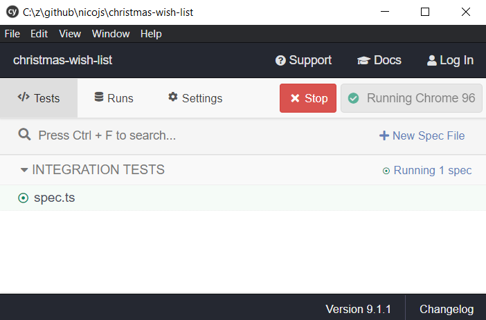

# Lab 9: UI testing with Cypress

Explanation about the setup: https://fullyunderstood.com/introduction-to-cypress-with-angular/#setup
Cypress angular schematics: https://github.com/cypress-io/cypress/tree/develop/npm/cypress-schematic

In this lab, we'll be testing our form using Cypress.

_Note: Be sure your application is running with (`ng serve`)_

## Exercise 1: Our first Cypress test

1. Install the Cypress for Angular plugin:
   ```bash
   ng add @cypress/schematic
   ```
   Installing cypress might take a while. Be patient.
1. Run cypress with `ng run cypress:open`
1. This should open cypress chromium shell
   
1. Click the `spec.ts` file. This runs the generated test coming with cypress. It should fail (it is looking for text that cannot be found).
1. Open the `spec.ts` test file in your code editor. Change the test to verify the correct title is shown:
   ```ts
   describe('My First Test', () => {
     it('Visits the initial project page', () => {
       cy.visit('/');
       cy.get('h1').contains('The big Christmas 🎅 list');
     });
   });
   ```
   Verify that the test now passes.
1. Rename the test file to `wish-list-page.spec.ts` and rename the `describe` and `it` to something more fitting to the test.

## Exercise 2: A test for "add product"

1. Add test which adds a product to the wishlist. You can use this as a reference:

   ```ts
   describe('add a wish form', () => {
     beforeEach(() => {
       cy.visit('/');
     });

     it('should add a wish to the list', () => {
       cy.get('#titleInput').type('Christmas tree');
       cy.get('#placeInput').type('1');
       cy.get('#currencyInput').select('Euro');
       cy.get('#priceInput').type('25.99');
       cy.get('form[data-test-id="product-form"]')
         .get('button[type="submit"]')
         .click();
       cy.get('ol[data-test-id="wish-list"]')
         .get('li:first-child')
         .should('contain.text', 'Christmas tree (€25.99)');
     });
   });
   ```

1. Run the test. It should fail at first.
1. Looking more closely at the selectors used in `cy.get('...')`, you can see that there are `data-test-id` attributes required to make them pass. Add them to your html template.\
   _Hint: they should be added to the add product `form` and the wish `ol` list_
1. Make sure all tests are passing

## Exercise 2: Add a `enterWish` command

It seems like we're going to enter data into the product form quite often. Time to create a custom command for it.

1. Open `cypress/support/commands.ts`. Add this command:

   ```ts
   declare namespace Cypress {
     interface Chainable<Subject = any> {
       enterWish: typeof enterWish;
     }
   }

   function enterWish(wish: import('cypress/models/wish').Wish): void {
     cy.get('#titleInput').type(wish.title);
     cy.get('#placeInput').type(wish.place.toString());
     cy.get('#currencyInput').select(wish.priceCurrency);
     cy.get('#priceInput').type(wish.priceAmount.toString());
   }

   Cypress.Commands.add('enterWish', enterWish);
   ```

1. Create a file `cypress/models/wish.ts`, and add a model for the wish:

   ```ts
   export interface Wish {
     title: string;
     place: number;
     priceAmount: number;
     priceCurrency: string;
   }
   ```

1. Import this new command. Open `cypress/support/index.ts` and add:

   ```ts
   import './commands';
   ```

1. Now that the command is created we can use it from our "should add a wish to the list" test:

   ```ts
   cy.enterWish({
     title: 'Christmas tree',
     place: 1,
     priceAmount: 25.99,
     priceCurrency: 'Euro',
   });
   ```
1. Make sure the test is still passing

## ... if time permits, create validation tests

With this new command in your back pocket, it's time to write some more tests. You can use this as skeleton:

```ts
describe('The wish list page', () => {
  // [...]
  describe('add a wish form', () => {
    // [...]
    it('should disable the add button when the form is invalid', () => {});

    it('should show a validation error when "place" is less then 0', () => {});
  });
});
```

Add more commands as you see fit.

## ... if time permits even more

Read up on cypress testing best practices: https://docs.cypress.io/guides/references/best-practices
