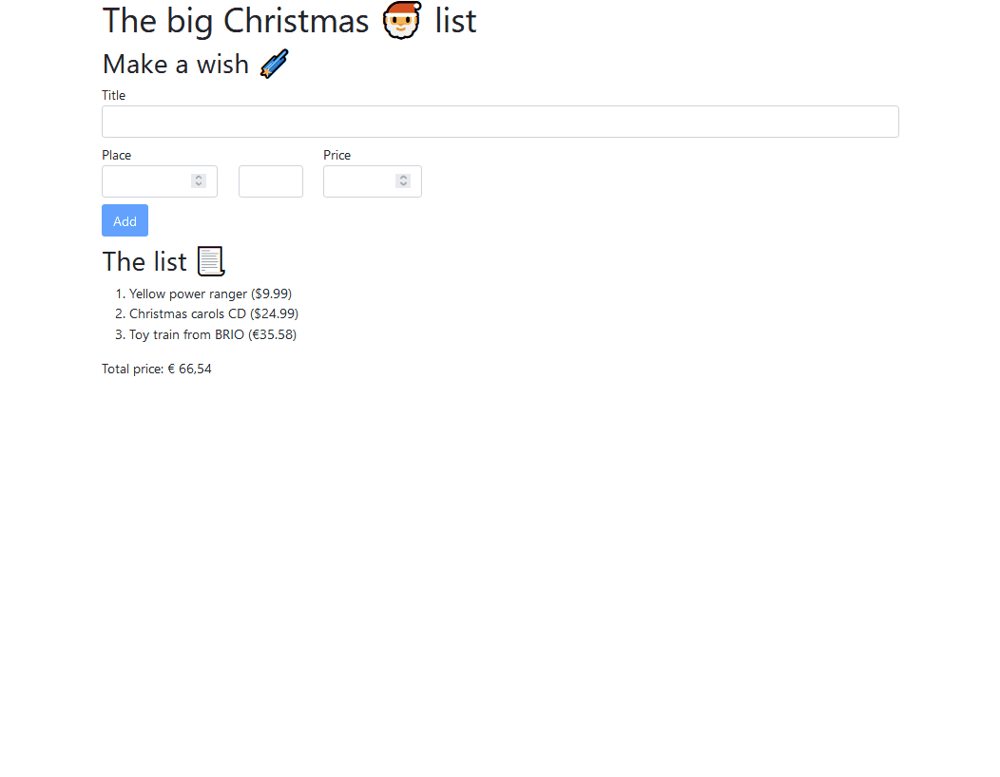

# Lab 10: HTTP and observables

_🎄 Christmas edition_

Good news everyone! We have a sponsor! A famous web shop has shown interest in our christmas themed wish list application. Just more evidence that hard work will pay off in the end!

In this lab, we'll be integrating the webshop into your wishlist application. The end result should look a bit like this:



Typing in the `title` field should fill the screen with suggestions for products from the webshop.

_Please fill out the evaluation for [this course using this link](https://www.metricsthatmatter.com/student/evaluation.asp?k=1070&i=36347)_

## Exercise 1: Prepare the webserver

In this exercise, we'll be using a tool called [json-server](https://www.npmjs.com/package/json-server) to spin up our webserver.

1. Install json-server:
   ```bash
   npm i -D json-server
   ```
1. Download the "christmas-wish-list.json" file and put it in the root of your project.
1. Open a new terminal and start the json-server using `npx json-server christmas-wish-list.json`.
1. Now open your browser and navigate to `http://localhost:3000`. This is where your web server lives. Play around with the server. Notice that:
   - http://localhost:3000/products provides all the products
   - http://localhost:3000/products?\_expand=supplier provides all products with their respective suppliers
   - http://localhost:3000/products?\_page=1 provides the first 10 products
   - http://localhost:3000/products?q=trui provides all products where the title contains "trui".

## Exercise 2: Create the products service

1. Expand the `Product` class with two additional fields: `href` and `imgUrl`. Both should be optional and of type `string`.
1. Create a service for retrieving products. You can use this template:

   ```ts
   export class ProductService {
     constructor(private http: HttpClient) {}

     search(contains: string): Observable<Product[]> {
       // TODO
     }
   }
   ```

1. Implement the `search` method. It should return the first page of products that contains the text. For example, use url `http://localhost:3000/products?q=trui&_page=0&_expand=supplier` when the provided text is `'trui'`.
1. Inject the `ProductService` in your `AppComponent` class. Test it out with this test code:

   ```ts
   export class AppComponent {
     // [...]

     products?: Product[];
     ngOnInit() {
       this.productService.search('trui').subscribe((products) => {
         console.log(
           'products',
           products.map((product) => product.display())
         );
         this.products = products;
       });
     }
   }
   ```

1. Open the console (using F12 tools) and verify that the products are printed to the console correctly.\
   _Note:_ if you run into this error: `ERROR TypeError: product.display is not a function`, remember that the server is providing you with plain JSON objects. It is your job to create actual instances of the `Product` class in the `ProductService` class.

## Exercise 3: Create products cards

In this exercise we create the product cards. If you are familiar with the way Angular components work, you may create these cards in a new component, for example `product-cards`.

1. Add the product cards just below the form. You can use this HTML:

   ```html
   <div class="row">
     <div
       *ngFor="let product of products"
       class="card text-center"
       style="width: 18rem;"
     >
       <div class="card-img-top">
         
       </div>
       <div class="card-body">
         <h5 class="card-title">{{product.title}} {{product.price | price}}</h5>
         <p class="card-text">
           <a target="_blank" [href]="product.href" class="card-link"
             >More info</a
           >
         </p>
         <button type="button" class="btn btn-primary mr-1">
           Add to list!
         </button>
       </div>
     </div>
   </div>
   ```

1. Open the page, you should already see the first 10 products with the text "trui" in the title.
1. Create and implement the click handler for the "Add to list!" button. It should add the product to the wish list. On top of the list (place 1) is fine, the web shop is a good sponsor after all!

## Exercise 4: Bind the `title` input to the product search

This is the final step in our endeavour: binding it all together. Typing in the "title" input should search for products containing that text. We will be using observables for this.

1. Bind to the `value$` property of the `title` input. You can start with this template code:

   ```ts
   export class AppComponent {
     // [...]
     private readonly titleInput = new FormControl<string>(
       '',
       Validators.required
     );

     ngOnInit() {
       this.titleInput.value$.subscribe((value) => {
         this.productService.search(value).subscribe((products) => {
           this.products = products;
         });
       });
     }
   }
   ```

   _Note:_ If you've chosen in lab 08 to move the form to a separate component, you will have to pass that `this.titleInput.value$` along to the `AppComponent`. You can do this using this property:

   ```ts
   export class ProductFormComponent {
     // [...]
     private readonly titleInput = new FormControl<string>(
       '',
       Validators.required
     );

     public get titleValue$(): Observable<string | null> {
       return this.titleInput.value$;
     }
   }
   ```

   And then you can select this component in your `AppComponent` with this code:

   ```ts
   export class AppComponent implements OnAfterViewInit {
     // [...]

     // 👇 This will select the form component in the view
     @ViewChild(ProductFormComponent)
     private productFormComponent?: ProductFormComponent;

     // 👇 The productFormComponent will be initialized when the view gets initialized. So we implement the `ngAfterViewInit` lifecycle event.
     ngAfterViewInit(): void {
       this.productFormComponent!.titleValue$.subscribe((value) => {
         this.productService.search(value).subscribe((products) => {
           this.products = products;
         });
       });
     }
   }
   ```

1. This already works... somewhat. But we can improve quite a lot using RXJS operators. Use https://rxjs.dev/ and the slides as inspiration and implement the following improvements:
   1. Make sure there is only 1 `subscribe` in the code. You should be able to use `pipe` the typed text directly into the product service with an operator.
   1. The search should only be done when you have typed a word of 2 letters or more.
   1. In order to not send too many HTTP requests to the server, implement a delay of 500ms between type and search.
   1. When we're dealing with a slow server, you don't want the user to be looking at old results. Clear the old products from the screen when you do a new search.
   1. Maybe you can think of more improvements to be done?
1. Remove the `ngOnInit` added in exercise 2. It is no longer needed now that we have product search implemented!

## If time permits...

_Please fill out the evaluation for [this course using this link](https://www.metricsthatmatter.com/student/evaluation.asp?k=1070&i=36347)_

Well. This was about it. You're on your own now. Thanks for participating!

Some inspiration for additional assignments:

- Create and implement a `WishService` that can store and retrieve wishes.
- Add a loading animation when searching for products.
- Add error handling for when the backend is down.
  - Add local storage to store your wishes client side and store them on the server side when the server is back online.
